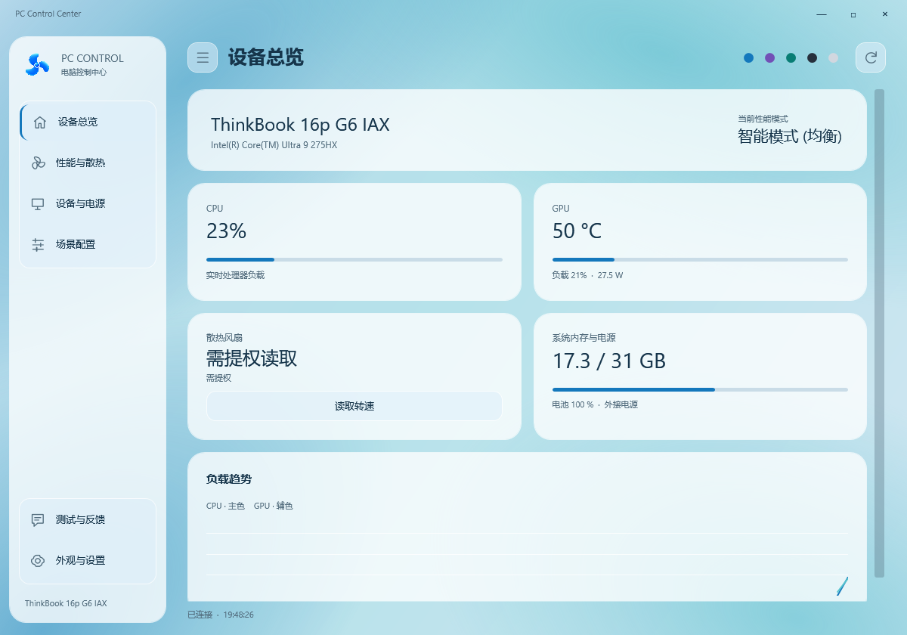

# PC Control Center · 电脑控制中心

[](https://github.com/202200800669-commits/PCControlCenter/actions/workflows/build.yml)
[](LICENSE)
[](docs/compatibility.md)

**因为我的 ThinkBook 缺少方便的手动风扇调节入口，我做了这个控制台。现在希望和更多用户一起，把它逐步做成适配多品牌电脑的控制中心。**

这是一个 Windows 桌面开源项目，提供设备监控、动态主题、场景配置与参考机型的受控硬件操作。欢迎联想、华硕、机械革命及其他品牌用户参与试用，提交型号信息、检测结果和使用问题，帮助完善适配。

[下载试用版](https://github.com/202200800669-commits/PCControlCenter/releases) · [提交反馈](https://github.com/202200800669-commits/PCControlCenter/issues/new/choose) · [功能与兼容范围](docs/compatibility.md)

> 当前为 **0.1.0-alpha.17 社区试点版**。多品牌框架已经建立，但不能据此理解为所有品牌都能调风扇。华硕、机械革命等设备目前主要用于品牌识别、只读检测和反馈采集；专用硬件写入仍按精确型号与 BIOS 白名单开放。

alpha.17 优化监控、页面切换和动态背景开销：后台读取硬件，可见页面合并刷新，隐藏窗口暂停普通监控；保留持续手动调速和恢复机制。[性能测试与范围](docs/performance.md)

## 界面预览



[观看 59 秒带字幕演示](https://github.com/202200800669-commits/PCControlCenter/releases/download/v0.1.0-alpha.14/PC-Control-Center-demo.mp4)（alpha.14 外观演示，含配乐；alpha.15 已改为持续手动调速）。

五种主题：**冰蓝、浅紫、薄荷、高级黑、简约白**。三种彩色主题采用持续变色的流动光影背景，搭配半透明卡片；支持关闭动效。侧栏可以收起，主要功能与左下角的反馈、设置各自分组。

## 有哪些亮点

- **把常用入口放在一起**：设备总览、性能与散热、设备与电源、场景配置、测试反馈、外观设置六个页面。
- **查看真实状态**：CPU 负载、内存、电池与供电状态；支持的 NVIDIA 设备可读取温度、负载和功耗。不可用读数显示为未知，不用演示数字冒充实测。
- **减少重复操作**：亮度和手动转速滑块在停止拖动后应用；硬件操作串行处理，手动控制期间保留恢复自动入口。
- **一次授权，持续控制**：标题右侧选择“授权”，本次软件运行期间共用一个受控 UAC 代理；选择“暂不授权”仍可查看普通监控，之后可在设置中手动授权。手动风扇保持设定转速，可继续拖动修改，直到恢复自动或关闭窗口；心跳中断时由独立工作进程恢复自动。
- **为多机型反馈做准备**：收集设备型号、BIOS、系统与驱动信息、能力探测结果以及可选的结构化操作记录，先预览，再导出 ZIP，通过 GitHub Issues 提交。
- **可继续扩展**：Core、Windows Providers、IPC/Broker 和 WPF 桌面界面分层，新的适配器可以按机型逐步加入。

## 功能列表

| 页面 | 已实现内容 | 适用条件 |
| --- | --- | --- |
| 设备总览 | 型号、CPU、内存、电池、GPU、负载趋势 | 读数取决于硬件、驱动和系统接口 |
| 性能与散热 | 性能模式、双风扇读取、持续手动转速、联动滑块、恢复自动 | 参考 ThinkBook 白名单；本次运行先授权一次 |
| 设备与电源 | 电量、供电与实际充电状态、循环次数、屏幕亮度、充电模式、夜间慢充、键盘背光、系统设置快捷入口 | 电池信息不需要 UAC，循环次数取决于固件；厂商控制限已适配设备 |
| 场景配置 | 保存与应用性能模式、亮度等配置 | 每一步执行与确认结果单独处理 |
| 测试与反馈 | 本地采集、内容预览、ZIP 导出、预填 GitHub 提交页 | 所有可运行客户端的测试用户 |
| 外观与设置 | 手动授权、五主题、流动光影开关、刷新间隔、托盘、开机启动、运行日志 | Windows 桌面客户端 |

## 当前适配范围

| 品牌 / 设备 | 当前状态 |
| --- | --- |
| Lenovo ThinkBook 16p G6 IAX，产品 21R0，BIOS R2CN57WW | 参考机型；专用读取与实验性控制路径已实现。当前版本仍需要持续实机回归 |
| ASUS / ROG / TUF | 品牌发现、通用监控与接口探测；专用写入尚未开放 |
| MECHREVO / 机械革命 | 品牌发现、通用监控与接口探测；专用写入尚未开放 |
| 其他 Windows PC | 通用监控；未匹配专用适配器的硬件写入关闭 |

**同品牌、相似型号或相同代工厂不等于兼容。** 更新 BIOS 后也需要重新核对。现阶段没有通用风扇曲线编辑、裸写 EC、通用超频或降压功能。恢复路径有超时和进程退出保护，但不能保证系统崩溃、强制终止整个进程树等情况下恢复成功。更多说明见 [兼容记录](docs/compatibility.md) 和 [安全说明](SECURITY.md)。

## 下载与启动

1. 从 [Releases](https://github.com/202200800669-commits/PCControlCenter/releases) 下载 Windows x64 ZIP。
2. 解压到一个固定目录，运行 `pc-control-desktop.exe`。自包含版已附带 .NET 运行时。
3. 首次先查看只读监控。参考机型要使用专用控制时，点击页面标题右侧“授权”；本次运行后续功能不再逐项弹 UAC。退出程序会结束授权，下次启动需重新授权。
4. 手动风扇在松开滑块后持续保持目标转速。“恢复自动”或关闭窗口会结束手动控制；单纯切换页面或最小化不影响保持。切换性能模式时先恢复自动散热；背光、充电设置会暂停手动控制，成功后恢复原转速。恢复未确认时停止后续写入。CLI 的旧版限时试验命令仍保留。

当前发布包没有 Authenticode 签名；可对照发布页 SHA-256 校验下载完整性。校验和不等于发布者身份认证。本项目不是任何电脑厂商的官方软件。

## 邀请不同品牌用户一起测试

无论你的电脑来自联想、华硕、机械革命，还是其他品牌，都欢迎先做**只读试用**。即使某项读数不可用，也能帮助我们识别适配差异。

建议反馈这些内容：

1. 品牌、完整型号、BIOS、Windows 版本，以及正在使用的官方控制软件名称。
2. CPU、GPU、内存、电池等显示是否正常；哪些内容缺失或显示异常。
3. 主题、字体、窗口缩放、侧栏、托盘与场景配置的使用问题。
4. 你最希望支持的功能。非白名单机型不要尝试绕过限制或修改硬件身份。
5. 复现步骤、预期结果、实际结果，必要时附截图。

### 从软件提交反馈

1. 左下角打开 **测试与反馈**，选择类型并填写问题。
2. 点击 **收集并预览**，检查将导出的内容。
3. 点击 **导出反馈包**，保存 ZIP。
4. 点击 **打开提交页**，会打开本仓库的新 Issue，并预填型号及简短问题描述。
5. 在 GitHub 编辑区拖入刚导出的 ZIP，确认内容后提交。

**软件不会自动上传日志，也不需要在软件中输入 GitHub Token。** GitHub 登录、附件上传和最终提交在浏览器中完成。自动记录仅导出时间、功能类别、结果标签，不导出原始异常、命令行或路径；问题描述由用户填写，发布前请自行检查个人信息。

### CLI 与维护者工具

```powershell
.\pc-control.exe probe
.\pc-control.exe export feedback.zip
.\pc-control.exe inspect-report feedback.zip
.\pc-control.exe feedback-template
```

`inspect-report` 只解析报告，限制 ZIP/JSON 大小并拒绝额外文件，不解压执行文件。用户反馈不会自动扩大硬件控制白名单。

## 本地开发

依赖 Windows x64 和 `global.json` 指定的 .NET SDK。仓库不包含个人电脑上的便携 SDK、已安装程序、真实诊断记录或视频原始帧。

```powershell
dotnet build PCControlCenter.sln -c Release
dotnet run --project tests/PCControlCenter.Tests -c Release --no-build
pwsh scripts/verify-source.ps1
dotnet format whitespace PCControlCenter.sln --no-restore --verify-no-changes
pwsh scripts/package.ps1
```

测试使用模拟探测器、受控子进程和隔离资源；通过自动测试不能代替跨机型硬件验证。持续集成会构建、测试、检查源代码边界并验证自包含包。

架构与贡献说明：[架构](docs/architecture.md) · [贡献指南](CONTRIBUTING.md) · [反馈流程](docs/feedback-workflow.md) · [第三方来源](THIRD_PARTY_NOTICES.md)

## 开源许可

[GPL-3.0-or-later](LICENSE)。欢迎提交 Issue、适配资料和 Pull Request。希望每一份反馈都能帮助下一款机型获得更可靠的支持。
