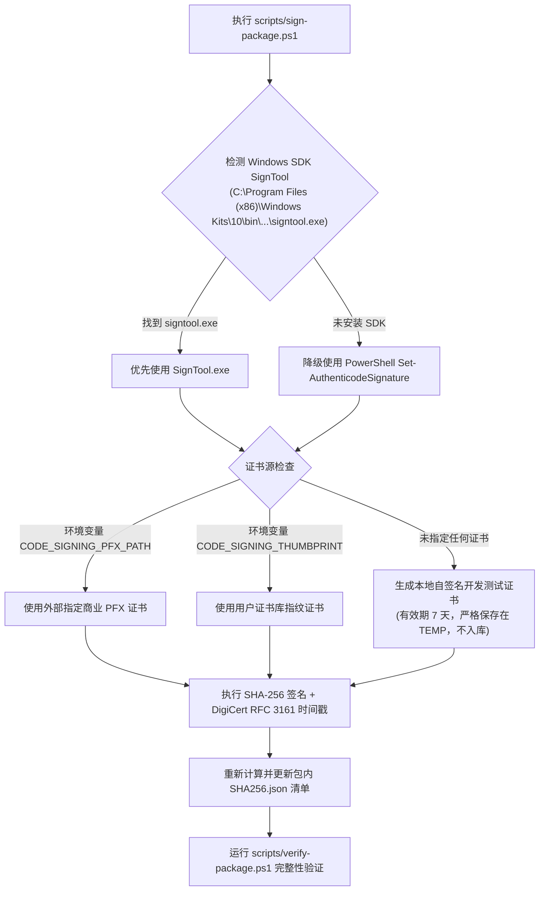

# 安装引导、代码签名与分发规范

本文档详述 PC Control Center 的交付体系，涵盖便携免安装模式、单用户免提权安装器、工业级 Inno Setup 安装包以及 Authenticode 代码签名工作流。

---

## 🚀 一、 软件交付形态

为平衡极客调试、日常便携使用与大众用户安装体验，项目支持三种并行分发形态：

| 交付形态 | 适用场景 | 目标路径 | 权限要求 | 系统集成度 |
| :--- | :--- | :--- | :---: | :--- |
| **便携免安装包 (Portable ZIP)** | 开发者测试、U 盘即插即用、极客排障 | 用户自定义解压路径 | 普通用户 (`asInvoker`) | 独立平铺运行，无系统注册表与快捷方式污染 |
| **单用户免提权安装器 (Per-User Installer)** | 普通终端用户日常安装使用（零依赖） | `%LocalAppData%\Programs\PCControlCenter` | 普通用户 (`asInvoker`) | 自动生成开始菜单与桌面图标，注册系统标准卸载项 |
| **Inno Setup 安装包 (Setup.exe)** | 正式发布渠道、安装向导向分发 | `%LocalAppData%\Programs\PCControlCenter` | 普通用户 (`PrivilegesRequired=lowest`) | 完整向导式安装、可选自启、国际化多语言与许可展示 |

---

## 🛠️ 二、 单用户免提权安装与卸载机制

### 1. 安装逻辑 (`scripts/install-peruser.ps1`)
- **零 UAC 提权**：默认安装至当前用户应用目录 `%LocalAppData%\Programs\PCControlCenter`，不触碰 `C:\Program Files` 与 `HKLM`。
- **平铺自包含**：完整同步 271 个运行库与资源文件，包含应用图标 `Control.ico` 与主程序 `pc-control-desktop.exe`。
- **快捷方式建立**：
  - 开始菜单：`%AppData%\Microsoft\Windows\Start Menu\Programs\PC Control Center.lnk`
  - 桌面：`Desktop\PC Control Center.lnk`
- **系统卸载注册**：
  - 注册表路径：`HKCU\Software\Microsoft\Windows\CurrentVersion\Uninstall\PCControlCenter`
  - 支持 Windows 10/11“设置 > 应用 > 安装的应用”及传统“控制面板”完整识别、展示图标、发布者与一键卸载。

### 2. 干净卸载逻辑 (`scripts/uninstall-peruser.ps1`)
- 自动终止正在运行的 `pc-control-desktop.exe`、`pc-control.exe`、`pc-control-broker.exe` 进程。
- 自动清理 `HKCU\Software\Microsoft\Windows\CurrentVersion\Run\PCControlCenter` 开机自启动注册表项。
- 移除开始菜单与桌面快捷方式。
- 清理卸载注册表项，并延时清理安装目录本体，无残留垃圾文件。

---

## 🔏 三、 Authenticode 代码签名工作流

### 1. 签名脚本 (`scripts/sign-package.ps1`)
自动化为发布包内的核心可执行文件（`pc-control.exe`、`pc-control-desktop.exe`、`pc-control-broker.exe`）注入数字签名：

### 2. 验签脚本 (`scripts/verify-signatures.ps1`)
调用 `Get-AuthenticodeSignature` 扫描发布目录内所有关键二进制文件，输出签名主体（Subject）、指纹（Thumbprint）、时间戳签发者（Timestamp）与合法性状态。

### 3. 生产发布凭据安全原则
- **私钥零入库**：代码库安全检查器（`scripts/verify-source.ps1`）严格拦截 `.pfx`、`.p12`、`.pem`、`.key` 等私钥后缀与私钥字符串。
- **CI 流水线配置**：在 GitHub Actions 中，真实商业代码签名证书应存放在 Repository Secrets 中（如 `BASE64_ENCODED_PFX`），在构建步骤中动态解码到临时文件完成签名，构建结束后立即销毁。

---

## 🖥️ 四、 桌面端体验深化特性

1. **静默启动参数 (`--minimized`)**：
   - 命令行传参 `pc-control-desktop.exe --minimized` 启动时，主窗口保持隐藏，直接最小化至系统托盘，不弹出主窗口打扰用户。
2. **开机自动启动**：
   - 用户在“常规与审计设置”页面可勾选“开机自动启动（最小化到托盘）”。
   - 客户端通过 `Microsoft.Win32.Registry` 安全写入 `HKCU\Software\Microsoft\Windows\CurrentVersion\Run`。
